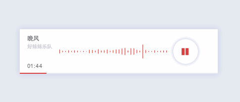
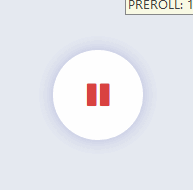

# mePlayer
[]()

一款简洁的HTML5音乐播放器。内置两套主题，可在运行时一键切换


## 主题说明 | [在线预览](newraina.github.io/mePlayer/demo)
### 默认主题
- 有歌词时滚动显示歌词，无歌词时显示模拟频谱动画
- 播放中鼠标悬停在界面上滑动滚轮可调节音量，音量大小用音量条表示




### 迷你主题
- 去掉了大部分控件，仅保留音量调节和播放暂停按钮
- 播放中鼠标悬停在界面上滑动滚轮可调节音量，音量大小用音量图标透明度表示



## 使用方法
- 引入`dist`文件夹中相关文件，或者`npm install meplayer`
- 初始化

  ```javascript
mePlayer({
    theme: '可选，不指定时为默认主题，值为"mini"时为迷你版主题',
    music : {
        src   : '音乐文件地址',
        title : '歌名',
        author: '歌手名',
        cover : '封面路径',
        lrc   : '歌词字符串：[00:24.600]温柔的晚风\n[00:27.830]轻轻吹过 爱人的梦中\n ...'
    },
    target: '放置播放器的DOM容器，如: .music'
});
  ```
- 运行中可使用`meplayer.play()`和`meplayer.pause()`手动播放暂停
- `meplayer.toggleTheme()`可一键切换主题

## 致谢
- 制作过程中参考了[APlayer](https://github.com/DIYgod/APlayer)的部分代码
- UI设计参考了[bottom-music-player](https://dribbble.com/shots/2365362-A-or-B-Bottom-music-player-dashboard)
